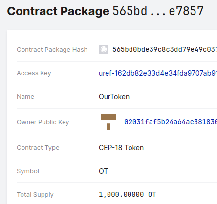
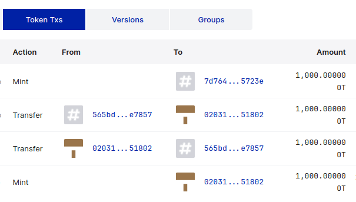
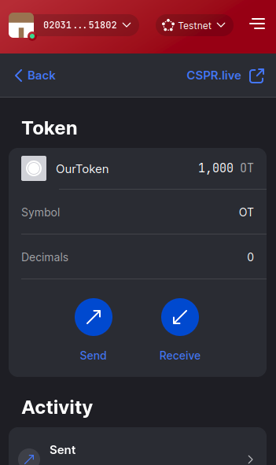

# Deploying a Token on Casper Livenet
In this tutorial, we will take the token we created in
the previous one and deploy it on the Livenet Casper network,
using the Odra Livenet backend.

We will also take a look at the tools that Casper Ecosystem
provides to interact with our newly deployed token.

:::info
Most of this tutorial will work with any Casper contract.
:::

## Casper Wallet

We will be using Casper Wallet to do some tasks in this tutorial.
To install it, please follow the instructions on the
[official website](https://www.casperwallet.io/).

After setting up the wallet, extract the private key of the account
you want to use for our testing.
You can do this by clicking on the Menu > Download account keys.

:::warning
You are solely responsible for the security of your private keys.
We recommend creating a new account for the testing purposes.
:::

Why do we need the private key? We will use it in Odra to deploy
our contract to the Casper network using Livenet backend.

## Getting tokens
To deploy the contract on the Livenet, we need to have some CSPR.
The easiest way to get them is to use the faucet, which will send
us 1000 CSPR for free. Unfortunately, only on the Testnet.

To use the faucet, go to the [Casper Testnet Faucet](https://testnet.cspr.live/tools/faucet).
Log in using your Casper Wallet account and click on the "Request Tokens" button.

:::note
One account can request tokens only once. If you run out of tokens, you can
either ask someone in the Casper community to send you some, or simply create a new account
in the wallet.
:::

Now, when we have the tokens, we can deploy the contract. Let's do it using Odra!

## Odra Livenet
Odra Livenet is described in detail in the
[backends section](../backends/livenet) of this documentation.
We will then briefly describe how to use set it up in this tutorial.

In your contract code, create a new file in the bin folder:

```rust title="bin/our_token_livenet.rs"
//! Deploys a new OurToken contract on the Casper livenet and mints some tokens for the tutorial
//! creator.
use std::str::FromStr;

use odra::casper_types::U256;
use odra::host::{Deployer, HostEnv, HostRef, HostRefLoader};
use odra::Address;
use ourcoin::token::{OurTokenHostRef, OurTokenInitArgs};

fn main() {
    // Load the Casper livenet environment.
    let env = odra_casper_livenet_env::env();

    // Caller is the deployer and the owner of the private key.
    let owner = env.caller();
    // Just some random address...
    let recipient = "hash-48bd92253a1370d1d913c56800296145547a243d13ff4f059ba4b985b1e94c26";
    let recipient = Address::from_str(recipient).unwrap();

    // Deploy new contract.
    let mut token = deploy_our_token(&env);
    println!("Token address: {}", token.address().to_string());

    // Propose minting new tokens.
    env.set_gas(1_000_000_000u64);
    token.propose_new_mint(recipient, U256::from(1_000));

    // Vote, we are the only voter.
    env.set_gas(1_000_000_000u64);
    token.vote(true, U256::from(1_000));

    // Let's advance the block time by 11 minutes, as
    // we set the voting time to 10 minutes.
    // OH NO! It is the Livenet, so we need to wait real time...
    // Hopefully you are not in a hurry.
    env.advance_block_time(11 * 60 * 1000);

    // Tally the votes.
    env.set_gas(1_500_000_000u64);
    token.tally();

    // Check the balances.
    println!("Owner's balance: {:?}", token.balance_of(&owner));
    println!(
        "Tutorial creator's balance: {:?}",
        token.balance_of(&recipient)
    );
}

/// Deploys a contract.
pub fn deploy_our_token(env: &HostEnv) -> OurTokenHostRef {
    let name = String::from("OurToken");
    let symbol = String::from("OT");
    let decimals = 0;
    let initial_supply = U256::from(1_000);

    let init_args = OurTokenInitArgs {
        name,
        symbol,
        decimals,
        initial_supply,
    };

    env.set_gas(300_000_000_000u64);
    OurTokenHostRef::deploy(env, init_args)
}

/// Loads a contract. Just in case you need to load an existing contract later...
fn _load_cep18(env: &HostEnv) -> OurTokenHostRef {
    let address = "hash-XXXXX";
    let address = Address::from_str(address).unwrap();
    OurTokenHostRef::load(env, address)
}
```

In your `Cargo.toml` file, we need to add a new dependency, a feature and
register the new binary. In the end, it should look like this:

```toml title="Cargo.toml"
[package]
name = "ourcoin"
version = "0.1.0"
edition = "2021"

[dependencies]
odra = { version = "1.0.0", features = [], default-features = false }
odra-modules = { version = "1.0.0", features = [], default-features = false }
odra-casper-livenet-env = { version = "1.0.0", optional = true }

[dev-dependencies]
odra-test = { version = "1.0.0", features = [], default-features = false }

[build-dependencies]
odra-build = { version = "1.0.0", features = [], default-features = false }

[features]
default = []
livenet = ["odra-casper-livenet-env"]

[[bin]]
name = "ourcoin_build_contract"
path = "bin/build_contract.rs"
test = false

[[bin]]
name = "ourcoin_build_schema"
path = "bin/build_schema.rs"
test = false

[[bin]]
name = "our_token_livenet"
path = "bin/our_token_livenet.rs"
required-features = ["livenet"]

[profile.release]
codegen-units = 1
lto = true

[profile.dev.package."*"]
opt-level = 3
```

Finally, add the `.env` file with the following content:

```env title=".env"
# Path to the secret key of the account that will be used to deploy the contracts.
ODRA_CASPER_LIVENET_SECRET_KEY_PATH=folder_with_your_secret_key/secret_key_file.pem

# RPC address of the node that will be used to deploy the contracts.
ODRA_CASPER_LIVENET_NODE_ADDRESS=http://138.201.80.141:7777

# Chain name of the network.
ODRA_CASPER_LIVENET_CHAIN_NAME=casper-test
```

Of course, you need to replace the secret key's path
with the path to the secret key file you downloaded from the Casper Wallet.

:::note
One of the problems you may encounter is that the node you are using
will be down or will not accept your calls. In this case, you will
have to find and use another node IP address.
:::

Now, we will run our code:

```bash
cargo run --bin our_token_livenet --features livenet
```

If everything is set up correctly, you should see the output similar to this:

```
     Running `target/debug/our_token_livenet`
💁  INFO : Deploying "OurToken".
💁  INFO : Found wasm under "wasm/OurToken.wasm".
🙄  WAIT : Waiting 15s for "e6b34772ebc3682702674102db87c633b0544242eafd5944e680371be4ea1227".
🙄  WAIT : Waiting 15s for "e6b34772ebc3682702674102db87c633b0544242eafd5944e680371be4ea1227".
💁  INFO : Deploy "e6b34772ebc3682702674102db87c633b0544242eafd5944e680371be4ea1227" successfully executed.
💁  INFO : Contract "hash-565bd0bde39c8c3dd79e49c037e05eac8add2b2193e86a91a6bac068e0de7857" deployed.

Token address: hash-565bd0bde39c8c3dd79e49c037e05eac8add2b2193e86a91a6bac068e0de7857

💁  INFO : Calling "hash-565bd0bde39c8c3dd79e49c037e05eac8add2b2193e86a91a6bac068e0de7857" with entrypoint "propose_new_mint".
🙄  WAIT : Waiting 15s for "2f89cc96b6f8f05b88f8e75bef3a2f0ba39e9ab761693afff49e4112aa9d7361".
🙄  WAIT : Waiting 15s for "2f89cc96b6f8f05b88f8e75bef3a2f0ba39e9ab761693afff49e4112aa9d7361".
💁  INFO : Deploy "2f89cc96b6f8f05b88f8e75bef3a2f0ba39e9ab761693afff49e4112aa9d7361" successfully executed.
💁  INFO : Calling "hash-565bd0bde39c8c3dd79e49c037e05eac8add2b2193e86a91a6bac068e0de7857" with entrypoint "vote".
🙄  WAIT : Waiting 15s for "aca9ae847cfcb97c81b4c64992515ff14d6f63a60f7c141558463f5b752058a5".
🙄  WAIT : Waiting 15s for "aca9ae847cfcb97c81b4c64992515ff14d6f63a60f7c141558463f5b752058a5".
💁  INFO : Deploy "aca9ae847cfcb97c81b4c64992515ff14d6f63a60f7c141558463f5b752058a5" successfully executed.
💁  INFO : advance_block_time called - Waiting for 660000 ms
💁  INFO : Calling "hash-565bd0bde39c8c3dd79e49c037e05eac8add2b2193e86a91a6bac068e0de7857" with entrypoint "tally".
🙄  WAIT : Waiting 15s for "223b135edbeadd88425183abaec0b0afb7d7770ffc57eba9054e3ea60e9e9cef".
🙄  WAIT : Waiting 15s for "223b135edbeadd88425183abaec0b0afb7d7770ffc57eba9054e3ea60e9e9cef".
💁  INFO : Deploy "223b135edbeadd88425183abaec0b0afb7d7770ffc57eba9054e3ea60e9e9cef" successfully executed.

Owner's balance: 1000
Tutorial creator's balance: 1000
```

Congratulations, your contract is now deployed on the Casper network!
Before we move on, note the address of the token!

We will use it in the next section to interact with the token. In our case it is
`hash-565bd0bde39c8c3dd79e49c037e05eac8add2b2193e86a91a6bac068e0de7857`.

## Cspr.live

The first thing we will do is to explore Casper's network block explorer,
[cspr.live](https://cspr.live/). We can put the address of our token in the search bar
to find it.

:::note
If you deployed your contract on the Testnet, remember to make sure that the Testnet
network is selected in the dropdown menu in the top right corner.
:::

If everything is set up correctly, you should see the contract package's details.
Besides the owner, keys etc., you can also see the contract's metdata, if it
was developed using a standard that cspr.live supports.

Indeed, we can see that it detected that our contract is a CEP-18 token!
We see the name, symbol and total supply.
All the mentions of the contract on the website will use the token name instead
of the contract address.



Additionally, on the Token Txs tab, we can see the transactions that happened
with the token. We can see the minting transaction we did in the previous section
and transfers done during the voting process.



If we click on one of the accounts that recieved the tokens, we will go to the
account page. Here, on the Tokens tab, we can see all the tokens that the account
has - and OurToken is one of them!

If you wish, you can check the status of the contract deployed during the development
of this tutorial [here](https://testnet.cspr.live/contract-package/565bd0bde39c8c3dd79e49c037e05eac8add2b2193e86a91a6bac068e0de7857).

## Transferring Tokens using Casper Wallet

Casper wallet can do much more than just logging in to the faucet, exporting
the private keys and transferring CSPR. It can also interact with the contracts
deployed on the network.

If you deployed the contract and left some OT tokens to yourself, you should see
them in the Casper Wallet window.

You should also be able to transfer them to another account!



## Conclusion

We've successfully deployed a token on the Casper network and interacted with it
using the Odra backend and Casper Wallet. We've also learned how to use the
cspr.live block explorer to check the status of your contract.

Odra, Cspr.live and Casper Wallet are just a few of the tools that the Casper ecosystem 
provides. Feel free to explore them on [casperecosystem.io](https://casperecosystem.io/).

